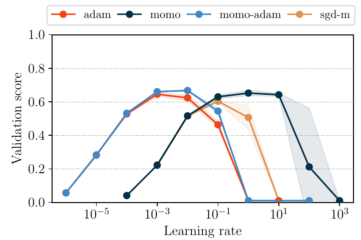
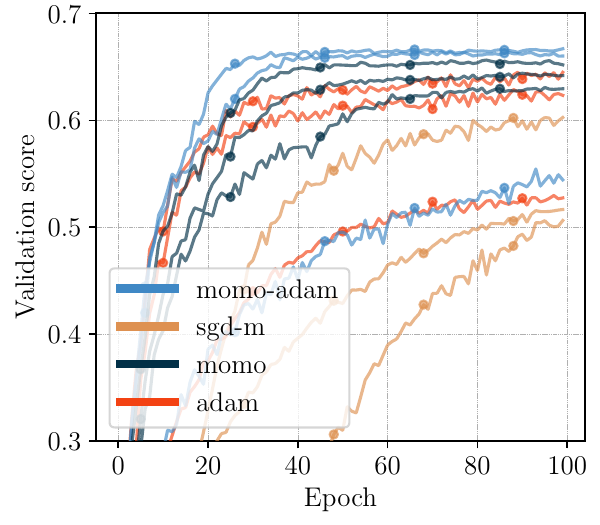
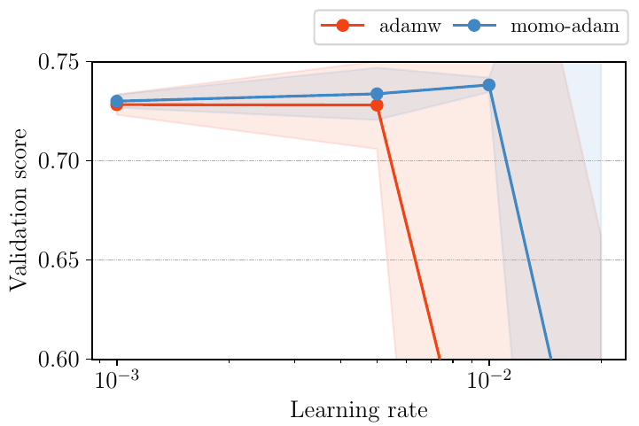
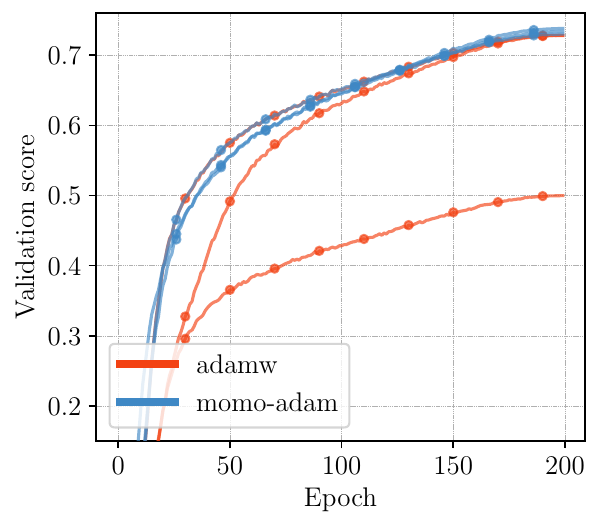
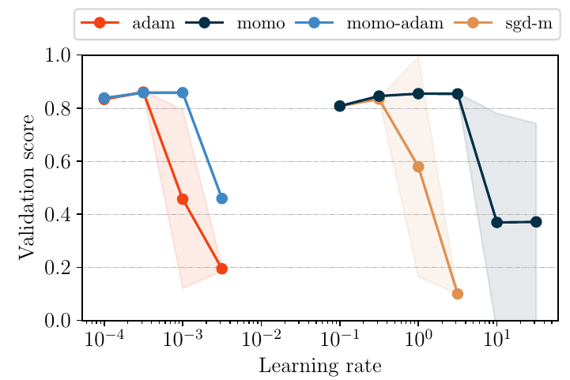
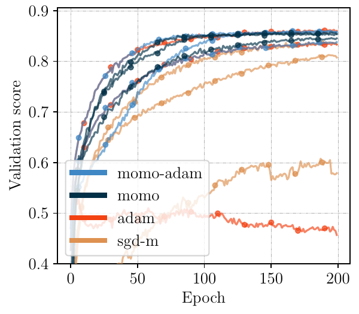

# MoMo: Momentum Models for Adaptive Learning Rates [[ICML2024](https://icml.cc/virtual/2024/poster/33842)]
[](https://arxiv.org/abs/2305.07583)
[](https://pypi.python.org/pypi/momo-opt/)

Pytorch implementation of MoMo optimizer. Adaptive learning rates for SGD with momentum (SGD-M) and Adam. 

*Authors: Fabian Schaipp, Ruben Ohana, Michael Eickenberg, Aaron Defazio, Robert M. Gower*

**MoMo and MoMo-Adam are drop-in replacements for SGD-M and Adam in order to reduce learning-rate tuning.**
We list some recommendations for hyperparamter setting below. 

Note that MoMo is also available in [`optax`](https://optax.readthedocs.io/en/latest/api/contrib.html#optax.contrib.momo).

## Installation

You can install the package with

```
pip install momo-opt
```

## Usage

Import the optimizers in Python with

``` python
from momo import Momo
opt = Momo(model.parameters(), lr=1)
```
or

``` python
from momo import MomoAdam
opt = MomoAdam(model.parameters(), lr=1e-2)
```

**Important: you only need to adapt one line of your training script, described below.** 
Momo needs access to the value of the (mini-batch) loss in the ``.step()`` method. The easiest way to do this is

``` python
loss = YOUR_LOSS_FUNCTION()
loss.backward()
opt.step(loss=loss)           # the line you need to change
```

Note that we have passed the loss as `torch.tensor`, you do not need to pass `loss.item()`.

**See [a full example script](example.py).**


Alternatively, you can pass a callable ``closure`` to the argument `closure` that computes gradients and returns the loss. 

For example:

``` python
def compute_loss(output, labels):
  loss = criterion(output, labels)
  loss.backward()
  return loss

# in each training step, use:
closure = lambda: compute_loss(output,labels)
opt.step(closure=closure)
```


## Examples

For a complete description of our experiments, please see the paper. Below are a few exemplary results. In the right-hand side plot, we plot the training curves for the best three LR values of each method.

### ResNet110 for CIFAR100

<p float="left">
    
    
</p>

### ViT for Imagenet


<p float="left">
    
    
</p>


### ViT for CIFAR10


<p float="left">
    
    
</p>


## Recommendations

In general, if you expect SGD-M to work well on your task, then use Momo. If you expect Adam to work well on your problem, then use MomoAdam.

* The option `lr` and `weight_decay` are the same as in standard optimizers. As Momo and MomoAdam automatically adapt the learning rate, you should get good performance without heavy tuning of the `lr` value and its schedule. Across many of our experiments, Momo with constant lerning rate set to `lr=1` performed very well (see plots above); for MomoAdam we recommend `lr=1e-2` (or slightly smaller).

* You can still combine Momo(Adam) with your favourite schedule, if you want to (and if you know a good schedule for your problem).


* The option `lb` refers to a lower bound of your loss function. In many cases, `lb=0` will be a good enough estimate (for instance for all of the above plots we used `lb=0`). If your loss converges to a large positive number (and you roughly know the value), then set `lb` to this value (or slightly smaller). 

* If you can not estimate a lower bound before training, use the option `use_fstar=True`. This will activate an online estimation of the lower bound.

* For Momo, the argument `beta` refers to the momentum parameter. The default is `beta=0.9`. For MomoAdam, `(beta1,beta2)` have the same role as in Adam and default to `(0.9,0.999)`.


## Citation

If you use MoMo, please cite

```
@Article{Schaipp2023,
  author        = {Fabian Schaipp and Ruben Ohana and Michael Eickenberg and Aaron Defazio and Robert M. Gower},
  title         = {Mo{M}o: {M}omentum Models for Adaptive Learning Rates},
  year          = {2023},
  month         = may,
}
```