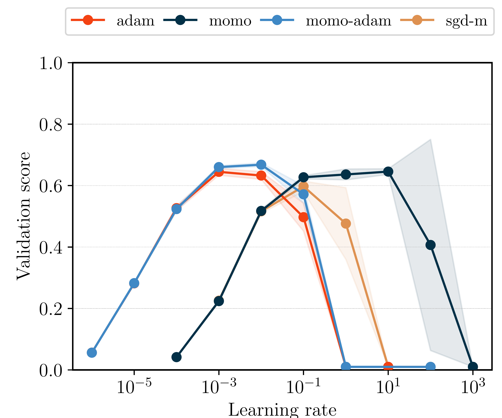
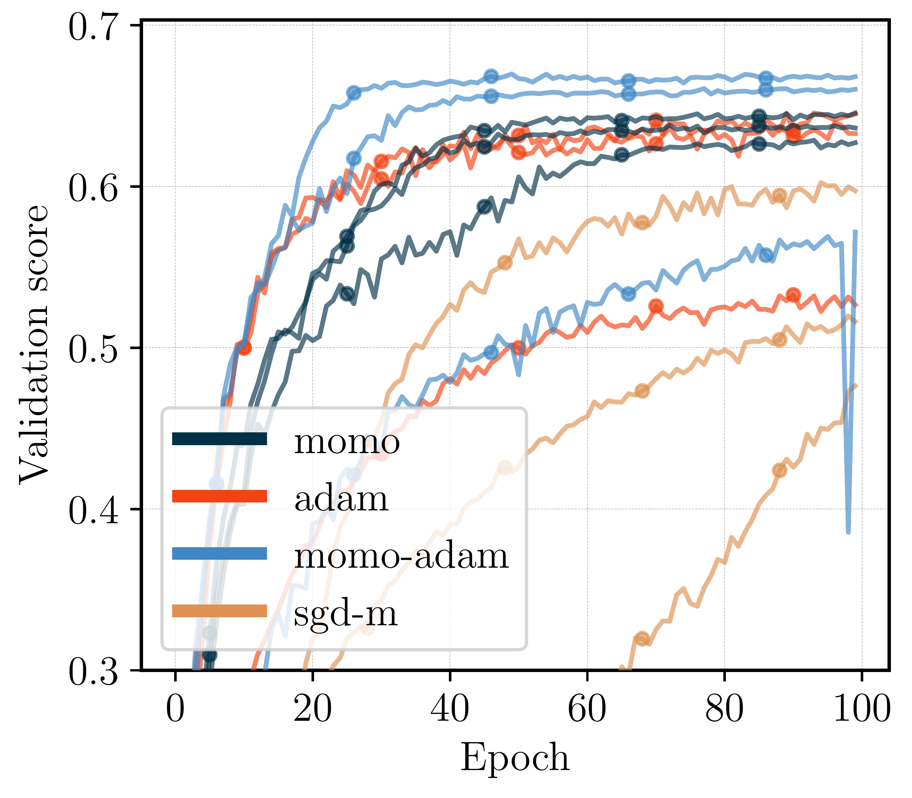
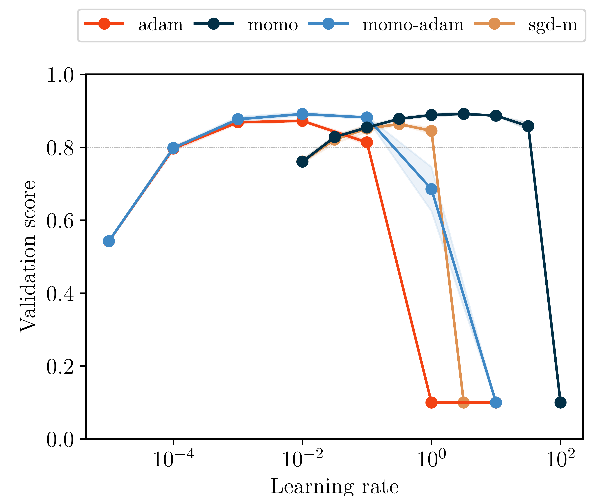
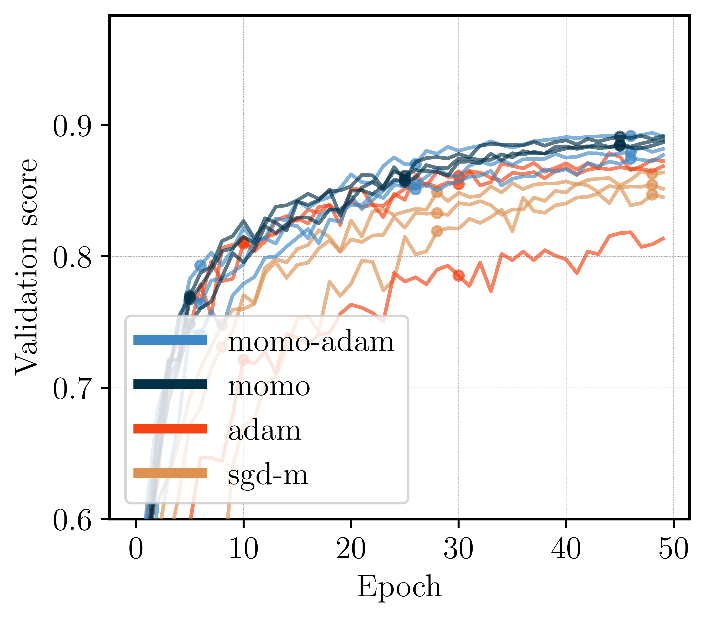

# MoMo
[](https://arxiv.org/abs/2305.07583)

Pytorch implementation of MoMo methods. Adaptive learning rates for SGD with momentum (SGD-M) and Adam. 

*Authors: Fabian Schaipp, Ruben Ohana, Michael Eickenberg, Aaron Defazio, Robert M. Gower*

## Installation

You can install the package with

```
pip install momo-opt
```

## Usage

Import the optimizers in Python with

``` python
from momo import Momo
opt = Momo(model.parameters(), lr=1)
```
or

``` python
from momo import MomoAdam
opt = MomoAdam(model.parameters(), lr=1e-2)
```

**Note that Momo needs access to the value of the batch loss.** 
In the ``.step()`` method, you need to pass either 
* the loss tensor (when backward has already been done) to the argument `loss`
* or a callable ``closure`` to the argument `closure` that computes gradients and returns the loss. 

For example:

``` python
def compute_loss(output, labels):
  loss = criterion(output, labels)
  loss.backward()
  return loss

# in each training step, use:
closure = lambda: compute_loss(output,labels)
opt.step(closure=closure)
```
**For more details, see [a full example script](example.py).**


## Examples

### ResNet110 for CIFAR100

<p float="left">
    
    
</p>

### ResNet20 for CIFAR10


<p float="left">
    
    
</p>


## Recommendations

In general, if you expect SGD-M to work well on your task, then use Momo. If you expect Adam to work well on your problem, then use MomoAdam.

* The option `lr` and `weight_decay` are the same as in standard optimizers. As Momo and MomoAdam automatically adapt the learning rate, you should get good performance without heavy tuning of `lr` and setting a schedule. In our experiments, we get good results for Momo with constant lerning rate set to `lr=1`; for MomoAdam `lr=1e-2` (or slightly smaller) should work well.

**One of the main goals of Momo optimizers is to reduce the tuning effort for the learning-rate schedule and get good performance for a wide range of learning rates.**

* For Momo, the argument `beta` refers to the momentum parameter. The default is `beta=0.9`. For MomoAdam, `(beta1,beta2)` have the same role as in Adam.

* The option `lb` refers to a lower bound of your loss function. In many cases, `lb=0` will be a good enough estimate. If your loss converges to a large positive number (and you roughly know the value), then set `lb` to this value (or slightly smaller). 

* If you can not estimate a lower bound before training, use the option `use_fstar=True`. This will activate an online estimation of the lower bound.


## Citation

If you use MoMo, please cite

```
@Article{Schaipp2023,
  author        = {Fabian Schaipp and Ruben Ohana and Michael Eickenberg and Aaron Defazio and Robert M. Gower},
  title         = {Mo{M}o: {M}omentum Models for Adaptive Learning Rates},
  year          = {2023},
  month         = may,
}
```